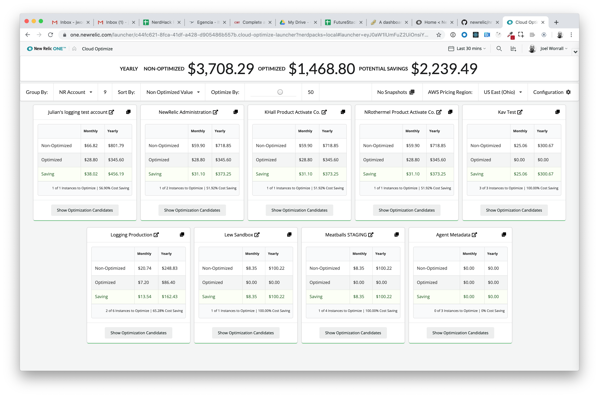
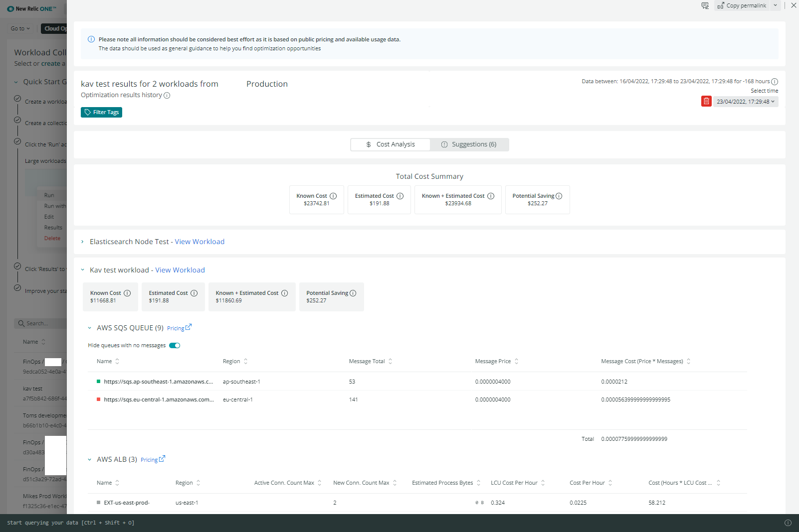

# Cloud Optimize (nr1-cloud-optimize)

 [](https://snyk.io/test/github/newrelic/nr1-cloud-optimize)

## Usage

Cloud Optimize analyzes your cloud environment using the [`New Relic Infrastructure`](https://newrelic.com/products/infrastructure) cloud integrations.

The application compares the size of your instances to their utilization, identifying resources that are sized larger than needed. Cloud Optimize will estimate your savings by optimizing resource size.

Users of Cloud Optimize are able to select the hosts, regions and other configurations to specify their unique business use cases.

This application supports AWS, GCP, and Azure cloud infrastructures.





> In-Context Application Optimization requires APM

## Open Source License

This project is distributed under the [Apache 2 license](blob/master/LICENSE).

## Dependencies

Requires [`New Relic Infrastructure`](https://newrelic.com/products/infrastructure).

You'll get the best possible data out of this application if you also:

- [Activate the EC2 integration](https://docs.newrelic.com/docs/integrations/amazon-integrations/get-started/connect-aws-infrastructure) to group by your AWS cloud provider account.
- [Activate the Azure VMs integration](https://docs.newrelic.com/docs/integrations/microsoft-azure-integrations/azure-integrations-list/azure-vms-monitoring-integration) to group by your Azure cloud provider account.
- [Activate the Google Compute integration](https://docs.newrelic.com/docs/integrations/google-cloud-platform-integrations/gcp-integrations-list/google-compute-engine-monitoring-integration) to group by your GCP cloud provider account.
- [Install APM on your applications](https://docs.newrelic.com/docs/agents/manage-apm-agents/installation/install-agent#apm-install) to group by application.

## Getting started

First, ensure that you have [Git](https://git-scm.com/book/en/v2/Getting-Started-Installing-Git) and [NPM](https://www.npmjs.com/get-npm) installed. If you're unsure whether you have one or both of them installed, run the following command(s) (If you have them installed these commands will return a version number, if not, the commands won't be recognized):

```bash
git --version
npm -v
```

Next, install the [NR1 CLI](https://one.newrelic.com/launcher/developer-center.launcher) by going to [this link](https://one.newrelic.com/launcher/developer-center.launcher) and following the instructions (5 minutes or less) to install and setup your New Relic development environment.

Next, to clone this repository and run the code locally against your New Relic data, execute the following commands:

```bash
nr1 nerdpack:clone -r https://github.com/newrelic/nr1-cloud-optimize.git
cd nr1-cloud-optimize
nr1 nerdpack:serve
```

Visit [https://one.newrelic.com/?nerdpacks=local](https://one.newrelic.com/?nerdpacks=local), navigate to the Nerdpack, and :sparkles:

## Deploying this Nerdpack

Open a command prompt in the nerdpack's directory and run the following commands.

```bash
# If you need to create a new uuid for the account to which you're deploying this Nerdpack, use the following
# nr1 nerdpack:uuid -g [--profile=your_profile_name]
# to see a list of APIkeys / profiles available in your development environment, run nr1 credentials:list
nr1 nerdpack:publish [--profile=your_profile_name]
nr1 nerdpack:deploy [-c [DEV|BETA|STABLE]] [--profile=your_profile_name]
nr1 nerdpack:subscribe [-c [DEV|BETA|STABLE]] [--profile=your_profile_name]
```

Visit [https://one.newrelic.com](https://one.newrelic.com), navigate to the Nerdpack, and :sparkles:

## Community Support

New Relic hosts and moderates an online forum where you can interact with New Relic employees as well as other customers to get help and share best practices. Like all New Relic open source community projects, there's a related topic in the New Relic Explorers Hub. You can find this project's topic/threads here:

[https://discuss.newrelic.com/t/cloud-optimizer-nerdpack/82936](https://discuss.newrelic.com/t/cloud-optimizer-nerdpack/82936)

Please do not report issues with Cloud Optimize to New Relic Global Technical Support. Instead, visit the [`Explorers Hub`](https://discuss.newrelic.com/c/build-on-new-relic) for troubleshooting and best-practices.

## Issues / Enhancement Requests

Issues and enhancement requests can be submitted in the [Issues tab of this repository](https://github.com/newrelic/nr1-cloud-optimize/issues). Please search for and review the existing open issues before submitting a new issue.

## Contributing

Contributions are welcome (and if you submit a Enhancement Request, expect to be invited to contribute it yourself :grin:). Please review our [Contributors Guide](./CONTRIBUTING.md).

Keep in mind that when you submit your pull request, you'll need to sign the CLA via the click-through using CLA-Assistant. If you'd like to execute our corporate CLA, or if you have any questions, please drop us an email at opensource@newrelic.com.
