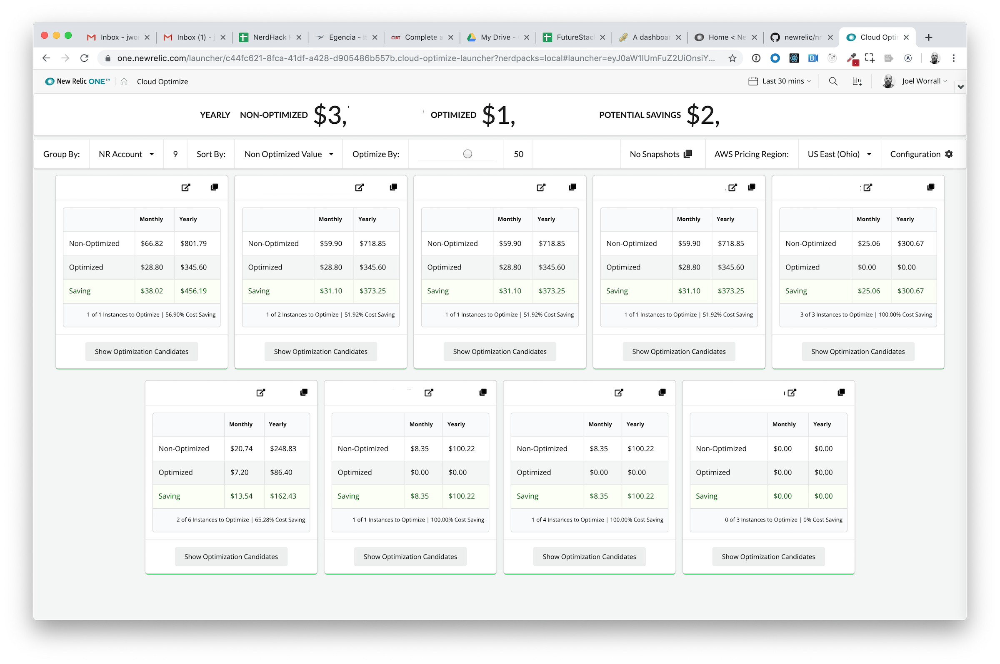
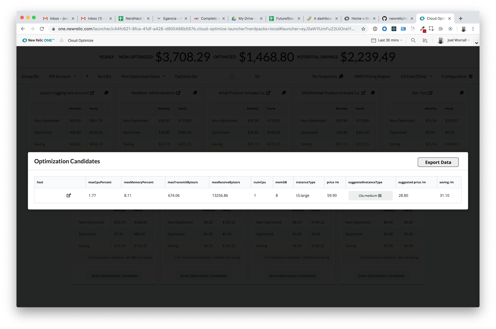
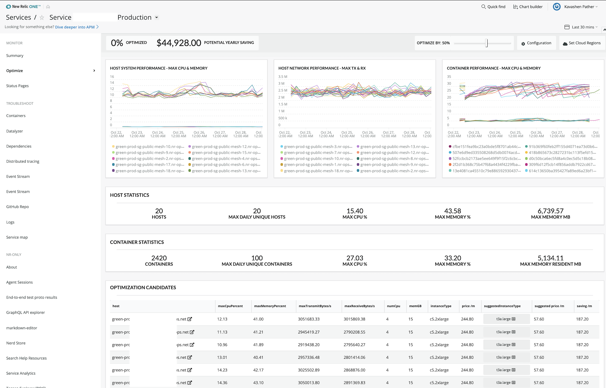

<a href="https://opensource.newrelic.com/oss-category/#new-relic-one-catalog-project"><picture><source media="(prefers-color-scheme: dark)" srcset="https://github.com/newrelic/opensource-website/raw/main/src/images/categories/dark/New_Relic_One_Catalog_Project.png"><source media="(prefers-color-scheme: light)" srcset="https://github.com/newrelic/opensource-website/raw/main/src/images/categories/New_Relic_One_Catalog_Project.png"></picture></a>

# Optimizer (nr1-cloud-optimize)

  

This application is maintained by the New Relic Labs team. Connect with us directly by [creating issues](../../issues) or [starting a discussion](../../discussions) in this repo.

## Usage

This application analyzes your environment using various integrations eg. Cloud Integrations, Infrastructure Agent, Kubernetes etc.
It shows cost and performance metrics per service so you can understand the potential impact to your environment as well as utilize the cost optimization suggestions.

### Features
- Historical Tracking
  - Compare & analysis before and after or against major events eg. Black friday

- Time range support
  - Isolate costs during specific periods

- Tag filtering
  - Isolate costs during specific periods

- Tuneable suggestions system (beta)
  - Provide high level insights and recommendations to teams

###  Service support

| AWS              | Azure     | GCP    | Other          | 
| ---------------- | --------- | ------ | -------------  |
| EC2              | VMS       | VMS    | K8s            |
| RDS              |           |        |                |
| APIGATEWAY       |           |        |                |
| ALB
| ELB
| SQS
| ELASTICSEARCH
| ELASTICACHE
| LAMBDA

### Contributing and improving
We are open to all suggestions that will help to improve the analysis, suggestions, services and any other capability you can think off. Please raise an issue with as much detail as possible.

### Screenshots

## Dependencies

Requires [`New Relic Infrastructure`](https://newrelic.com/platform/infrastructure).

You'll get the best possible data out of this application if you also:

- [Activate the EC2 integration](https://docs.newrelic.com/docs/integrations/amazon-integrations/get-started/connect-aws-infrastructure) to group by your AWS cloud provider account.
- [Activate the Azure VMs integration](https://docs.newrelic.com/docs/integrations/microsoft-azure-integrations/azure-integrations-list/azure-vms-monitoring-integration) to group by your Azure cloud provider account.
- [Activate the Google Compute integration](https://docs.newrelic.com/docs/integrations/google-cloud-platform-integrations/gcp-integrations-list/google-compute-engine-monitoring-integration) to group by your GCP cloud provider account.
- [Install APM on your applications](https://docs.newrelic.com/docs/agents/manage-apm-agents/installation/install-agent#apm-install) to group by application.
- [Install the Kubernetes integration](https://docs.newrelic.com/docs/kubernetes-pixie/kubernetes-integration/installation/kubernetes-integration-install-configure/) for node and container optimizations

## Enabling this App

This App is available via the New Relic Catalog. 

To enable it in your account: 
1. go to `Add Data > Apps and Visualzations` and search for "Cloud Optimize"
2. Click the `Cloud Optimize` card, and then click the `Add this App` button to add it to your account(s)
3. Click `Open App` to launch the app (note: on the first time accessing the app, you may be prompted to enable it)

Once you have added your accounts, you can also open the app by:
1. Open the `Apps` left-hand navigation menu item (you may need to click on the `Add More` ellipsis if it doesn't show up by default)
2. In the `Your Apps` section, locate and click on the `Cloud Optimize` card to open the app 

#### Manual Deployment
If you need to customize the app, fork the codebase and follow the instructions on how to [Customize a Nerdpack](https://developer.newrelic.com/build-apps/customize-nerdpack). If you have a change you feel everyone can benefit from, please submit a PR!

## Support

This project is actively maintained by the New Relic Labs team. Connect with us directly by [creating issues](../../issues) or [asking questions in the discussions section](../../discussions) of this repo.

We also encourage you to bring your experiences and questions to the [Explorers Hub](https://discuss.newrelic.com) where our community members collaborate on solutions and new ideas.

New Relic has open-sourced this project, which is provided AS-IS WITHOUT WARRANTY OR DEDICATED SUPPORT.

## Security

As noted in our [security policy](https://github.com/newrelic/nr1-cloud-optimize/security/policy), New Relic is committed to the privacy and security of our customers and their data. We believe that providing coordinated disclosure by security researchers and engaging with the security community are important means to achieve our security goals.
If you believe you have found a security vulnerability in this project or any of New Relic's products or websites, we welcome and greatly appreciate you reporting it to New Relic through [HackerOne](https://hackerone.com/newrelic).

## Contributing

Contributions are welcome (and if you submit a Enhancement Request, expect to be invited to contribute it yourself :grin:). Please review our [Contributors Guide](./CONTRIBUTING.md).

Keep in mind that when you submit your pull request, you'll need to sign the CLA via the click-through using CLA-Assistant. If you'd like to execute our corporate CLA, or if you have any questions, please drop us an email at opensource@newrelic.com.

## Open Source License

This project is distributed under the [Apache 2 license](blob/main/LICENSE).
